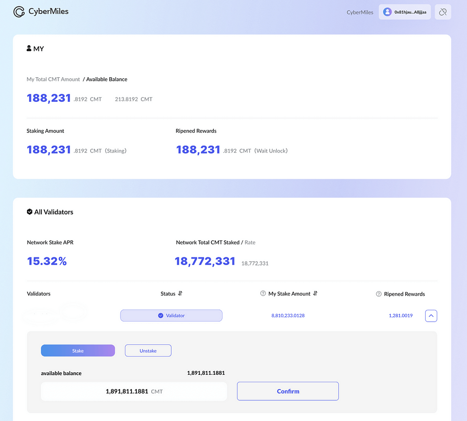

## **travis-x**

Based on geth, CyberMiles 2.0 program implemented in Golang, initiated and maintained by CyberMiles DAO.

### **[Hardware Requirements](https://github.com/CyberMiles/travis-x#hardware-requirements)**

Minimum:

- CPU with 2+ cores
- 4GB RAM
- 500GB free storage space to sync the Mainnet
- 5 MBit/sec download Internet service

Recommended:

- Fast CPU with 4+ cores
- 16GB+ RAM
- High-Performance SSD with at least 1TB free space
- 10+ MBit/sec download Internet service

### **[Docker quick start](https://github.com/CyberMiles/travis-x#docker-quick-start)**

One of the quickest ways to get CyberMiles up and running on your machine is by using Docker:

1. Install Docker
    
    It is recommended to use Docker version 20+. Refer to the official installation documentation **[here](https://docs.docker.com/engine/install/ubuntu/)**.
    
2. Download the genesis file
    
    Create a folder named /home/ubuntu/cmt, download the genesis.json file, and after extracting it, copy the genesis.json to the /home/ubuntu/cmt folder.
    
    ```bash
    cd /home/ubuntu;mkdir cmt;
    wget https://cmt-ss.s3.amazonaws.com/public/genesis-1695608495.tar.gz
    tar -zxvf genesis-1695608495.tar.gz
    cp ./genesis-1695608495/genesis.json ./cmt
    ```
    
3. Initialize genesis.json
    
    Initialization may require more than 16GB of memory. If your machine has less than 16GB of memory, it is recommended to add a 16GB memory swap before initializing to prevent initialization failure due to insufficient memory. 
    
    During initialization, you can monitor the progress through Docker logs. Initialization is typically completed in 5-10 minutes (depending on machine configuration) when you see the message "Successfully wrote genesis state" in the logs.
    ```
    sudo docker run -v /home/ubuntu/cmt:/cmt -d ghcr.io/cybermiles/travis-x:v2.0.0 init --datadir /cmt/data/ /cmt/genesis.json
    ```

4. Start a full node
    
    After successful initialization, you can use the following command to start a full node. The default HTTP port is 8547, and the WS port is 8548. You can modify other parameters as needed. Bootnodes are located in California, USA. It's advisable to deploy the full node machine as close as possible to the bootnodes to improve synchronization speed and stability.
    
    ```
    sudo docker run --net=host -v /home/ubuntu/cmt:/cmt -d ghcr.io/cybermiles/travis-x:v2.0.0 --datadir /cmt/data/ --networkid 18 --syncmode full --gcmode full --bootnodes enode://536ae68c9feb487af83d95f93d4c01243863233ede8ce1829d1c222d5cea3c2a11c26fe98005844fcc616ab6dd170c2a0b3d55888b93ef301747cb2efa2a8ccb@54.215.74.33:30304 --port 30304 --http --http.port 8547 --authrpc.port 8561 --http.addr 0.0.0.0 --http.vhosts "*" --http.api "net,eth,web3,debug,txpool" --http.corsdomain "*" --ws --ws.addr 0.0.0.0 --ws.port 8548 --ws.api "net,eth,web3,admin,txpool" --ws.origins "*" --snapshot=false
    ```
    
5. After a successful start, monitor the logs. If you see logs similar to the following, it means the startup was successful.
    
    ```
    INFO [09-27|06:05:04.587] Imported new chain segment               blocks=2048 txs=1  mgas=0.162  elapsed=393.503ms mgasps=0.411   number=16775 hash=a40d84..d1cb41 age=22h51m46s dirty=468.29KiB
    INFO [09-27|06:05:05.012] Imported new chain segment               blocks=2048 txs=5  mgas=0.678  elapsed=412.740ms mgasps=1.642   number=18823 hash=574e00..2f458b age=19h26m59s dirty=472.22KiB
    INFO [09-27|06:05:05.399] Imported new chain segment               blocks=2048 txs=0  mgas=0.000  elapsed=380.134ms mgasps=0.000   number=20871 hash=fd9b62..a5945a age=16h2m11s  dirty=472.22KiB
    INFO [09-27|06:05:05.818] Imported new chain segment               blocks=2048 txs=4  mgas=0.500  elapsed=411.146ms mgasps=1.217   number=22919 hash=5ef3db..48ba3f age=12h37m23s dirty=472.63KiB
    INFO [09-27|06:05:06.221] Imported new chain segment               blocks=2048 txs=7  mgas=1.108  elapsed=396.175ms mgasps=2.797   number=24967 hash=68ebf5..02ecab age=9h12m36s  dirty=480.29KiB
    INFO [09-27|06:05:06.641] Imported new chain segment               blocks=2048 txs=1  mgas=0.021  elapsed=412.549ms mgasps=0.051   number=27015 hash=e612d0..5bad23 age=5h47m48s  dirty=483.95KiB
    ```
    
    You can also use the following command to check the latest block number:
    ```
    curl http://127.0.0.1:8547 -X POST --data '{"jsonrpc":"2.0","method":"eth_blockNumber","id":1}' -H "Content-Type: application/json"
    ```

# **About CyberMiles Validators**

Validators stake CMTs and set up nodes that participate in the consensus to earn awards. The award to each validator is proportional to the total stake in its node.

A CMT holder can declare his candidacy to become a validator. He will need to run a CyberMiles 2.0 node.

We have created a Dapp that allows any CMT holder to do this from a web UI. The website will launch with CyberMiles 2.0.

A validator candidate can be promoted to validator through the DAO consensus (i.e., a vote by active validators). It only starts to earn CMT awards after becoming a validator. The DAO promotes validator candidates to validator based on the following criteria:

- The validator candidate has successfully run a CyberMiles 2.0 node without issues for a period of time.
- The validator candidate was able to attract delegator stakes from the community, or the validator owner has staked a significant amount of CMTs to his own node.

A validator can be removed and revert back to a validator candidate by a DAO vote if he fails to meet the above two requirements continuously.

CyberMiles 2.0 will mint 5 CMTs as a block award for each new block. The block award will be distributed to active validators and their delegators every 15 days through the validator contract. The validator must be in good standing for the entirety of the 15 days to receive block awards for this period. 20% of the block awards are allocated to validators to reward their effort in node operations.

Let’s say that s_ij is the CMTs staked at validator i by delegator j. v_i is the validator i’s income for each block it is active.

```
v_i = 5 * Sum_j(s_ij) / Sum_i(Sum_j(s_ij)) * 20%
```

Here’s some important information that you may find useful:

There are no more than 21 validator nodes, and CMT holders can vote for different validators and receive CMT rewards from the CyberMiles network.

- After the completion of the CyberMiles 2.0 hard fork upgrade, all previously staked CMTs have returned to their respective owners' addresses.
- Validator candidates can be promoted to validators through DAO consensus (active validator voting). They begin earning CMT rewards only after becoming validators. If validators continuously fail to meet the relevant requirements, they may be removed and reverted to validator candidates through DAO voting.
- CyberMiles 2.0 will mint 5 CMTs as a block reward for each new block. This reward will be distributed to active validators and their delegators every 15 days through the validator contract. Validators must maintain a good reputation throughout the entire 15-day period to receive block rewards. 20% of the block rewards are allocated to validators to reward their efforts in node operations.
- While anyone can independently call and use Validators-related smart contracts, to ensure visibility within the community and a good user experience, we recommend submitting your information to **[cmtstake.com](http://cmtstake.com/)**, a governance product.

Therefore, the complete process of becoming a CyberMiles Validator should be as follows:

1. Deploy a CyberMiles full node program and register as a validator candidate.
2. Provide your node information to **[cmtstake.com](http://cmtstake.com/)**. This will help other users stake to different Validators more conveniently. Your email may need to include:
    1. Node public key, which is the address that accepts delegations and receives delegation rewards (usually the same address).
    2. Provide information about your node, including who you are, whether you plan to self-stake CMTs, and the amount of self-staking, to help other Validators understand you.
        1. While the registration and deployment of a validator candidate are actions that do not require permission, **[cmtstake.com](http://cmtstake.com/)**, as an independently operated ecosystem product, reserves the right to decide whether to display any information and will respond to emails after confirming the addition of Validator information.
3. After DAO consensus, officially become a CyberMiles Validator and start participating in the ecosystem's development and governance.

### **Duties and Rights of Validators**

- Maintain stable operation of the Validator program and provide secure and available RPC services as much as possible.
- Help or deploy protocols or other infrastructure that benefits the CyberMiles ecosystem.
- Accept CMT stake from any user and represent them in ecosystem decisions.
- All Validators can share a 20% share of all newly minted CMTs, with the remaining portion being distributed to staking users.

## **[Contribution](https://github.com/CyberMiles/travis-x#contribution)**

Thank you for considering helping out with the source code! We welcome contributions from anyone on the internet and are grateful for even the smallest of fixes!

If you'd like to contribute to travis-x, please fork, fix, commit, and send a pull request for the maintainers to review and merge into the main code base.

Please make sure your contributions adhere to our coding guidelines:

- Code must adhere to the official Go **[formatting](https://golang.org/doc/effective_go.html#formatting)** guidelines (i.e., uses **[gofmt](https://golang.org/cmd/gofmt/)**).
- Code must be documented adhering to the official Go **[commentary](https://golang.org/doc/effective_go.html#commentary)** guidelines.
- Pull requests need to be based on and opened against the **`master`** branch.
- Commit messages should be prefixed with the package(s) they modify.

## **[License](https://github.com/CyberMiles/travis-x#license)**

The travis-x library (i.e., all code outside of the **`cmd`** directory) is licensed under the **[GNU Lesser General Public License v3.0](https://www.gnu.org/licenses/lgpl-3.0.en.html)**, also included in our repository in the **`COPYING.LESSER`** file.

The travis-x binaries (i.e., all code inside the **`cmd`** directory) are licensed under the **[GNU General Public License v3.0](https://www.gnu.org/licenses/gpl-3.0.en.html)**, also included in our repository in the **`COPYING`** file.